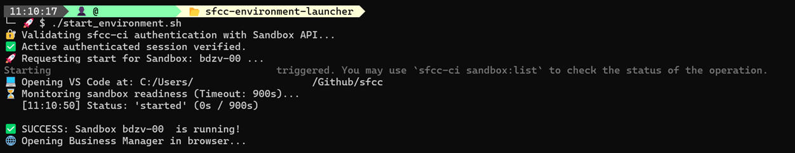

# SFCC Sandbox Launcher

An automated Bash script to spin up a Salesforce Commerce Cloud (SFCC) On-Demand Sandbox, open Visual Studio Code, monitor sandbox readiness, and launch Business Manager upon completion.

## 🚀 Demo

Here is a quick overview of how the launcher initializes the environment, validates authentication, and starts the sandbox:

<p align="center">
  
</p>

> ℹ️ **Note:** When executed via the automated Windows Task, the script runs silently in the background (headless). The terminal UI shown above won't pop up, but VS Code and Business Manager will open automatically when ready. To see live execution logs, run `./start_environment.sh` manually.

---

## ✨ Features

* 🔐 **Automated Authentication:** Authenticates with `sfcc-ci` using API client credentials.
* 🚀 **Sandbox On-Demand Start:** Triggers the sandbox boot process asynchronously.
* 💻 **Workspace Integration:** Launches VS Code in your specified local project directory.
* ⏳ **Real-Time Polling:** Monitors sandbox state changes (`stopped` ➔ `started`) via `sfcc-ci`.
* 🌐 **Browser Auto-Launch:** Automatically opens Business Manager once the instance is fully running.
* ⚙️ **Windows Automation:** Optionally register a Windows Scheduled Task to run everything on system logon.

---

## 🛠️ Prerequisites

Ensure the following tools are installed on your machine:

* [Node.js](https://nodejs.org/) (v16+ recommended)
* [Git Bash](https://gitforwindows.org/) (for Windows environments)
* [Visual Studio Code](https://code.visualstudio.com/) (with `code` command added to `PATH`)

---

## ⚙️ Setup & Configuration

1. **Clone the repository:**
   ```bash
   git clone [https://github.com/salva-sm/sfcc-environment-launcher.git](https://github.com/salva-sm/sfcc-environment-launcher.git)
   cd sfcc-sandbox-launcher
   ```

2. **Install dependencies:**
   ```bash
   npm install
   ```

3. **Configure Environment Variables:**
   Create a `.env` file in the root folder (see `.env.example`). Only the project path
   is really required:
   ```env
   LOCAL_PROJECT_PATH=C:/Users/your-user/Github/your-repo
   ```

   `SFCC_REALM`, `SFCC_INSTANCE` and `SFCC_OAUTH_CLIENT_ID` are optional: when they are
   empty, the scripts read them from the project's `dw.json` — `hostname`
   (`<realm>-<instance>.dx.commercecloud.salesforce.com`) gives the realm and the
   instance, `client-id` gives the API client. `dw.json` is looked up at the project root
   and one level below it (e.g. `source/dw.json`); if `LOCAL_PROJECT_PATH` points to a
   `*.code-workspace` file, every folder declared in it is searched. Set `DW_JSON_PATH`
   to point somewhere else. Values present in `.env` always win.

   No client secret is used: authentication always happens interactively in the browser
   (`sfcc-ci auth:login`).

4. **Optional: reuse your dotfiles as the source of truth**
   If you use the [dotfiles](https://github.com/salva-sm/dotfiles) repo, `LOCAL_PROJECT_PATH`
   and `LAUNCH_EDITOR` can be left empty and both are resolved from there:

   | `.env` | Taken from the dotfiles |
   | :--- | :--- |
   | `LOCAL_PROJECT_PATH` | the generated `vscode/workspaces/sfcc.code-workspace`, or `SFCC_PROJECT_DIR` in `git-bash/env.local` (relative to `vscode/workspaces/`) |
   | `LAUNCH_EDITOR` | `DOTFILES_EDITOR` in `git-bash/env.local` (`code` or `zed`) |

   The checkout is expected at `$HOME/Github/dotfiles`; set `DOTFILES_DIR` in `.env`
   for a different location. `.env` always wins when the value is present.

5. **Editor**
   `LAUNCH_EDITOR` accepts `code` or `zed` and defaults to VS Code. Because Zed can't
   open `*.code-workspace` files, it receives the folders declared inside the workspace
   instead. When you install the Windows task (below) without dotfiles present,
   `install.ps1` asks which editor to use and writes it to `.env`.

---

## 🔄 Windows Logon Automation (Optional)

You can configure Windows to run this script automatically every time you log in to your machine.

> ⚠️ **IMPORTANT (Administrator Required):** To install or remove the Scheduled Task, you **must run terminal as Administrator**. Otherwise, Windows will block the command due to insufficient privileges.

### Option 1: Via PowerShell (Recommended)
Open PowerShell as **Administrator** and run:

```powershell
.\install.ps1
```

### Option 2: Via Command Prompt (CMD)
Open CMD as **Administrator** and run:

```cmd
powershell -ExecutionPolicy Bypass -File install.ps1
```

### Option 3: Via NPM Shortcuts
```bash
# Install the task
npm run task:install

# Remove the task
npm run task:remove
```

---

## 📜 NPM Scripts Reference

The `package.json` file includes convenient shortcuts to simplify script execution and setup:

| Command | Description |
| :--- | :--- |
| `npm start` | Executes `start_environment.sh` to trigger authentication, sandbox startup, VS Code, and polling. |
| `npm run sfcc:auth` | Runs local `sfcc-ci` authentication directly without starting the sandbox. |
| `npm run task:install` | Registers the logon automation task in Windows Scheduled Tasks (**Requires Admin**). |
| `npm run task:remove` | Unregisters and deletes the `SFCC_Sandbox_Launcher` scheduled task (**Requires Admin**). |